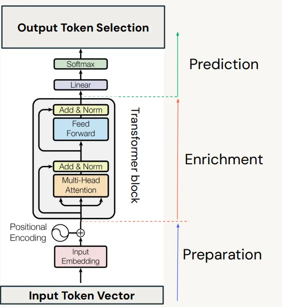
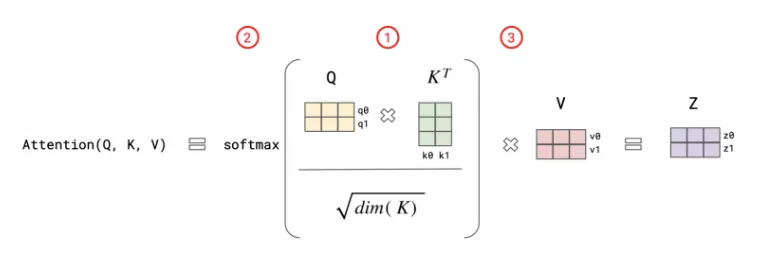
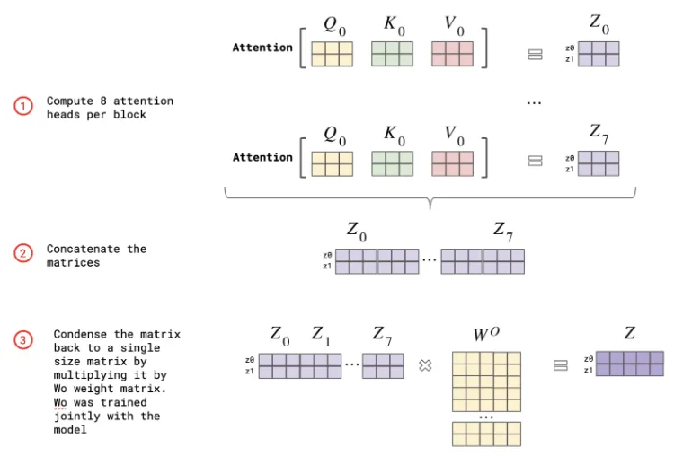
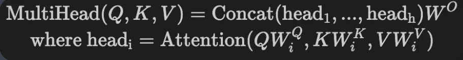
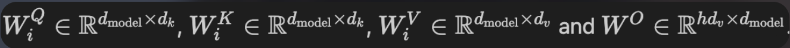
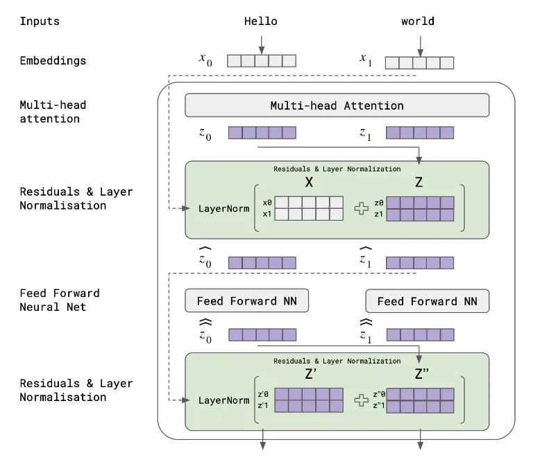

## 资料
* v1: https://arxiv.org/pdf/2205.14135
* v2: https://arxiv.org/pdf/2307.08691
* GPT with pytorch: https://medium.com/@akriti.upadhyay/building-custom-gpt-with-pytorch-59e5ba8102d4
* https://www.analyticsvidhya.com/blog/2024/04/mastering-decoder-only-transformer-a-comprehensive-guide/
* https://medium.com/@akriti.upadhyay/building-custom-gpt-with-pytorch-59e5ba8102d4

## 原理
### TF Decoder计算
* GPT transformer block:



```py
in_shape = [B, S] # shape
# after embeding, H在MHA中，要求为head_num的整数倍，这样就可以将H拆分到各head中完成
# embeding_size可以与hidden_size相同，也可能不同
# 如Llama3-8B，其embeding=8192, hidden_size=4096
# 
# 相关模型结构如
# torch:      H=512 h=8 h_d=64 
# GPT2-124M:  H=768
# GPT2-1.5B:  H=1600 h=25 h_d=64  embd_pos=1024
# Llama3-8B:  H=4096 h=32 h_d=128 embd_pos=8192
# gemma-2-2B: H=2304 h=8  h_d=256 (这里直接算是288，但官方给的是256)
# Qwen-72B:   H=8192 h=64 h_d=128 embd_pos=32768
in_shape = [B, S, H]
# after QKV weight 
Wqkv = [H, 3*H]
qkv = in_shape * Wqkv = [B, S, H] * [H, 3*H] = [B, S, 3, H] -> [B, S, 3, H] -> [B, S, 3, h, h_d]
```


### TF计算
* Attention



* MHA



* MHA公式：`h=8`, `d_model=64`, `d_k=d_model/h=64`，这里除`h`是避免多头的计算开销过大，除`h`后，多头的计算与单头的全维(512)计算开销一样：



单头全维时计算出来的`QWq = [B, S, d_model]`，而多头时，没个头计算为：`QWq = [B, S, d_k]`，MHA最终的输出仍然为`[B, S, d_model]`



* MHA另一个视角： 



* FFN：两个`linear`计算，有一个`ff_hidden_layer`，一般比Embed size大：
```py
# Decoder Block
class DecoderBlock(nn.Module):
    def __init__(self, d_model, num_heads, ff_hidden_layer, dropout):
        super(DecoderBlock, self).__init__()

        self.self_attention = nn.MultiheadAttention(d_model, num_heads, dropout=dropout)
        self.norm1 = nn.LayerNorm(d_model)
        self.dropout1 = nn.Dropout(dropout)
        self.linear1 = nn.Linear(d_model, ff_hidden_layer)
        self.linear2 = nn.Linear(ff_hidden_layer, d_model)
        self.norm2 = nn.LayerNorm(d_model)
        self.dropout2 = nn.Dropout(dropout)

    
    def forward(self, x,target_mask):
        attn_output, _ = self.self_attention(x, x, x, attn_mask=target_mask)
        x = x + self.dropout1(attn_output)
        x = self.norm1(x)
        ff_output = self.linear2(F.relu(self.linear1(x)))
        x = x + self.dropout2(ff_output)
        x = self.norm2(x)
        return x
```

* Predict phase: 预测阶段由一个`linear(d_model, vocab_size)`和`softmax`来生成最终的概率分布：
```py
class TransformerDecoder(nn.Module):
    def __init__(self, vocab_size, d_model, num_heads, ff_hidden_layer, dropout):
        super(TransformerDecoder, self).__init__()

        self.embedding = nn.Embedding(vocab_size, d_model)
        self.pos_encoder = PositionalEncoding(d_model, dropout)
        self.transformer_block = DecoderBlock(d_model, num_heads, ff_hidden_layer, dropout)
        self.linear = nn.Linear(d_model, vocab_size)
        self.softmax = nn.LogSoftmax(dim=-1)

    
    def forward(self, x):
        x = self.embedding(x)
        x = self.pos_encoder(x)
        tgt_mask = generate_square_subsequent_mask(x.size(0))
        x = self.transformer_block(x,tgt_mask)
        output = self.linear(x)
        output = self.softmax(output)
        return output  # [B, S, vocab_size]
```
* 最后经过Decoder出来的shape是：`[B, S, vocab_size]`，实际在推理中一个sequence只需要生成一个token，而这里生成了`S`个概率分布，一般都是取最好一个分布作为预测的下一个token：`[B, -1, vocab_size]`

### V1


### V2


