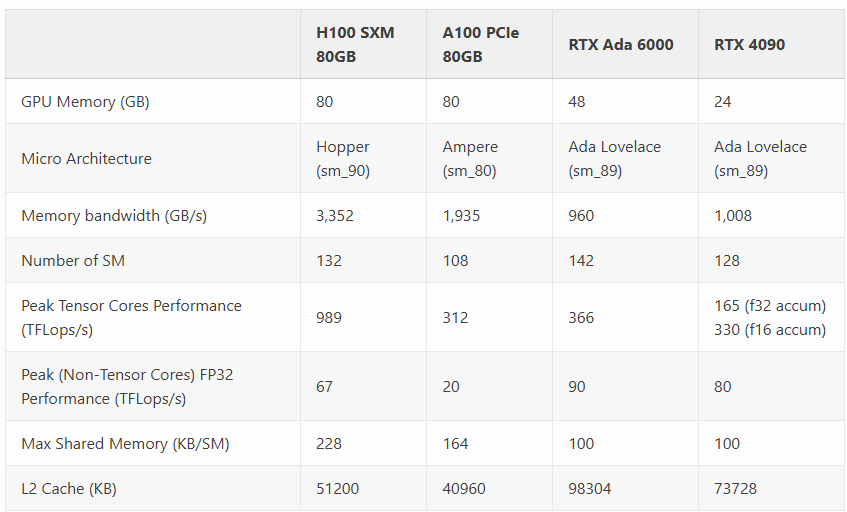
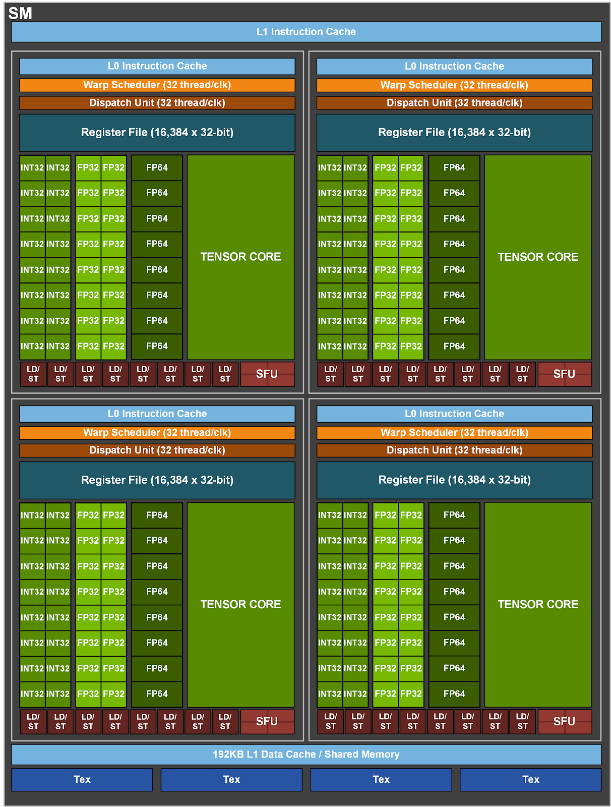

## Ampere
### 资料
* https://developer.nvidia.com/blog/nvidia-ampere-architecture-in-depth/

## Ada Architecture
### 资料
* https://images.nvidia.com/aem-dam/Solutions/geforce/ada/nvidia-ada-gpu-architecture.pdf
* https://flashinfer.ai/2024/02/02/introduce-flashinfer.html

* H100/A100使用HBM3和HBM2e，因此内存带宽远高于RTX Ada系列；
* RTX Ada有更高的non-Tensor Cores峰值性能，4090：80TFLops，A100：20TFLops，H100：67TFLops；
* H100的Tensor Cores峰值性能远高于A100, Ada 4090；
* Ada 4090的FP16性能是FP32的2倍，而其它卡FP32与FP16的峰值性能一样；

### SM
* 架构图

