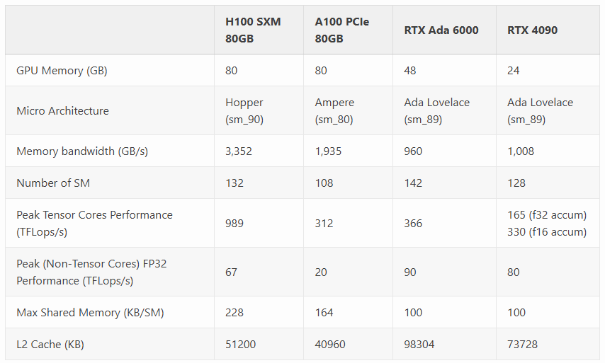
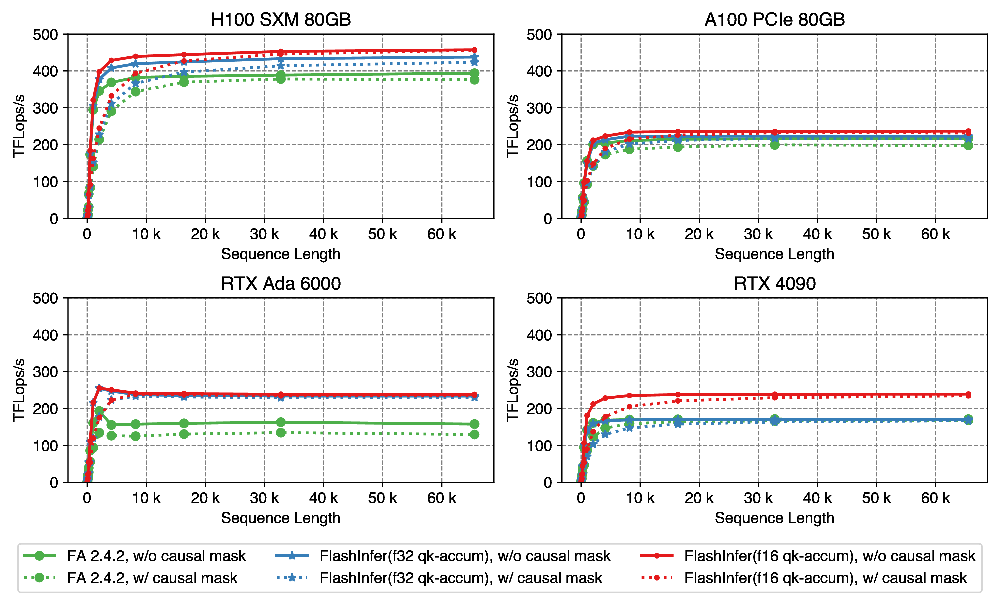
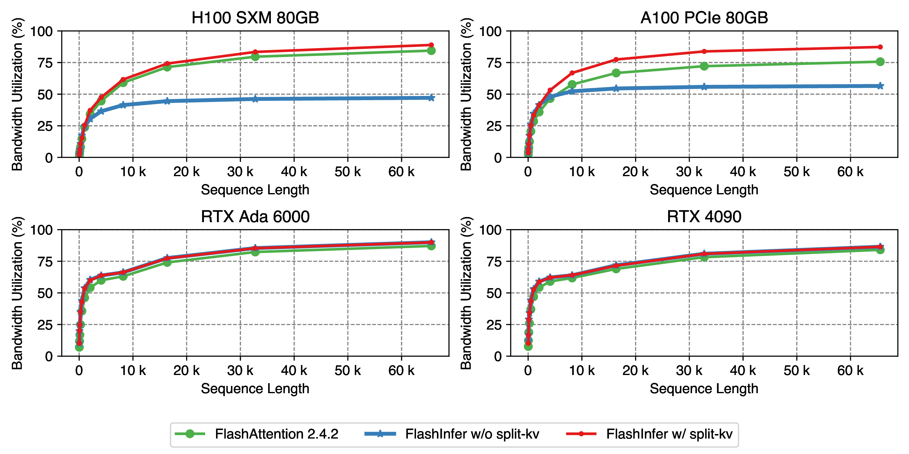

## 资料
* https://flashinfer.ai/
* https://flashinfer.ai/2024/02/02/introduce-flashinfer.html
* https://flashinfer.ai/2024/02/02/cascade-inference
* Flash-Decode: https://crfm.stanford.edu/2023/10/12/flashdecoding.html

## 介绍
* 该项目重点关注的是`self-attention`的计算效率，集成了当前最前沿的优化技术；
* 其将`self-attention`分为了三步：`prefill`, `decode`, `append`；
* 同时分析了单个请求和批量请求的场景下的性能瓶颈；
* 开源项目地址：https://github.com/flashinfer-ai/flashinfer/

### 优势
1. **Comprehensive Attention Kernels**: attention kernel集成了前沿的高性能优化技术，覆盖了single, batch下的：`prefill`, `decode`, `append` kernels，包含多种KVCache技术，如Paged Tneosr, Ragged Tensor, Page Table；
2. **Optimized Shared-Prefix Batch Decoding**: 利用[Cascade Attention](https://flashinfer.ai/2024/02/02/cascade-inference)技术，对batch Shared-Prefix推理场景，其性能相比vLLM最大提升近31x；
3. **Accelerate Attention for Compressed/Quantized KV-Cache**: 当前的LLM推理，经常会利用到KVCache量化/压缩技术，FlashInfer利用`GQA`, `Fused-RoPE Attention`, `Quantized Attention`技术来实现这些优化技术；

### 测试硬件环境
* GPU对比

* 用于`nvbench`项目来对kernel进行性能测试：https://github.com/NVIDIA/nvbench

### 性能测试
* 在文档中有多种性能测试对比，这里我只列出几个我比较关注的对比图；

#### Prefill Kernels
* FlashInfer重新实现了FAv2的kernel，使用了纯CUDA core和一些其它优化；
* 标准的FA实现是基于Tensor Core FP16 input and FP32 accumulator来实现，但RTX 4090 Tensor Core的FP32 accumulator有较低的性能，而QK计算过程
<math xmlns="http://www.w3.org/1998/Math/MathML">
  <mfrac>
    <mrow>
      <mrow data-mjx-texclass="ORD">
        <mi mathvariant="bold">q</mi>
      </mrow>
      <mo>&#x22C5;</mo>
      <msup>
        <mrow data-mjx-texclass="ORD">
          <mi mathvariant="bold">k</mi>
        </mrow>
        <mrow data-mjx-texclass="ORD">
          <mi>T</mi>
        </mrow>
      </msup>
    </mrow>
    <mrow>
      <msqrt>
        <mo stretchy="false">(</mo>
      </msqrt>
      <mi>d</mi>
      <mo stretchy="false">)</mo>
    </mrow>
  </mfrac>
</math>
有较小的数值范围，因此是可以直接使用FP16 accumulator来实现，因此FlashInfer提供了该优化参数：`allow_fp16_qk_reduction`；
* 如下图所示，该优化点在4090上有近50%的性能提升(红色 vs 绿色)，在A100/H100上提升不明显：

#### Decode Kernels
* Decode attention阶段KVCache长度远大于Query，因此在batchsize较小时，一般是Memory-Bound场景，因此GPU利用率是用不满的；（数据量小，带宽用不满，更多时间的消耗是在等待数据传输）
* 类似FlashAttention，FlashInfer的Decode Attention方案采用的是Split-K技巧，来实现GEMM优化，其会将KV-Cache在sequence维度拆成多个，以提升并行性；（Flash-Decode也是采用类似的思路）
* 如下图所示，为single-request的decode kernel性能，从这个图中可以注意到：
    1. batchsize=1，所以需要很大的sequence length才能用满内存带宽（一般达到80%）；
    2. RTX 4090卡上，`Split-KV`技术并没有性能提升，这是因为RTX 4090其内存带宽相对更小，但有更强的CUDA Core算力；
    3. A100下decode非Compute-Bound，所以只需要32/108个SM即可把内存带宽用满，同时因A100 Cuda Core只有10TFLops/s，因此采用`Split-KV`技术后，数据量减少，，因此可以进一步提升BW利用率，并可以让kernel进入Compute-Bound；

* Batch decode的测试结果如下，FlashInfer也有一定的效率提升：

![Batch decode kernel performance, use Llama2-7B setting: num_kv_heads=num_qo_heads=32, head_dim=128, batch_size=[1,16,64]. Sequence length varies from 32 to 65536 for batch_size = 1, from 32 to 4096 for batch_size = 16, and from 32 to 1024 for batch_size = 64](./batch-decode.png)
