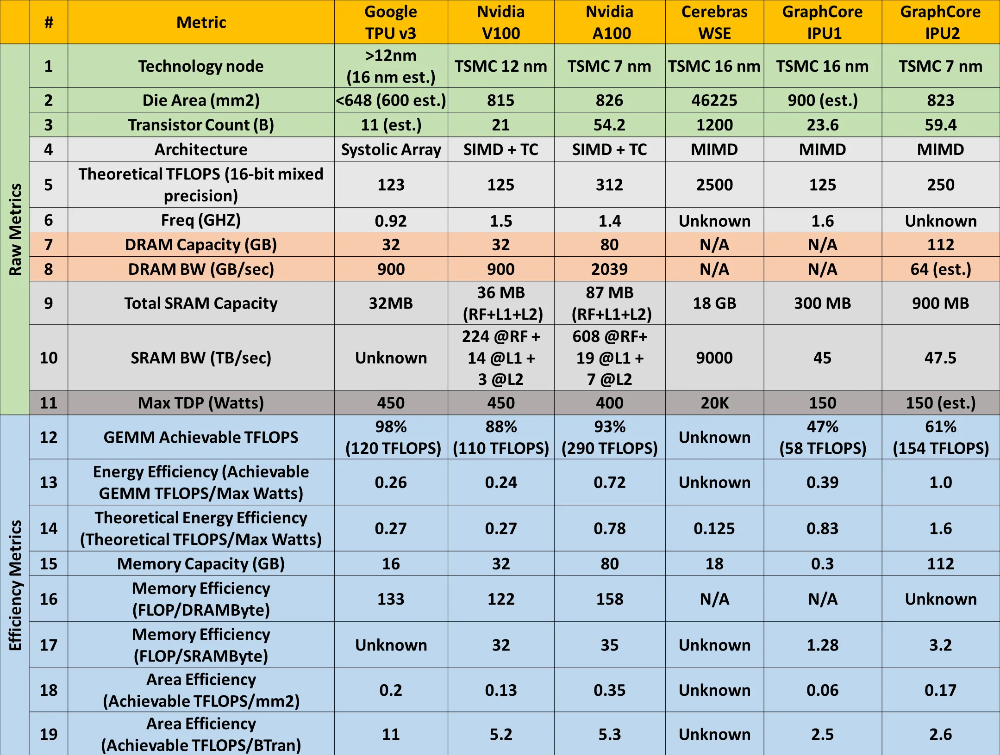
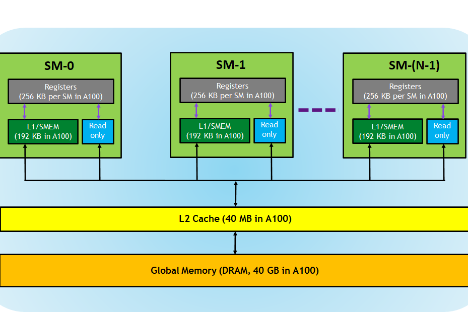
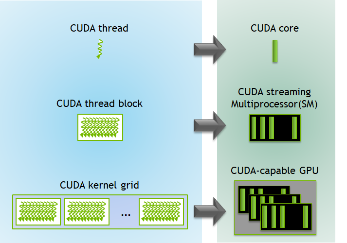
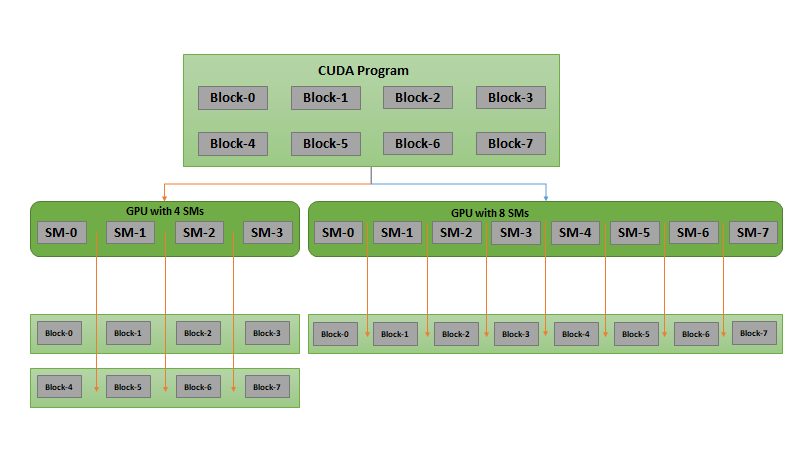
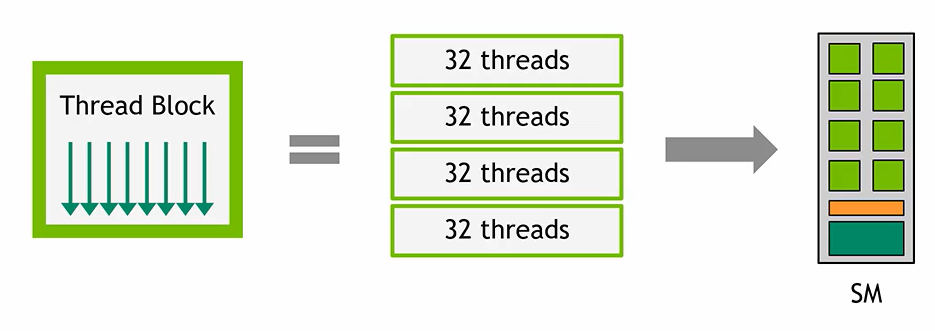
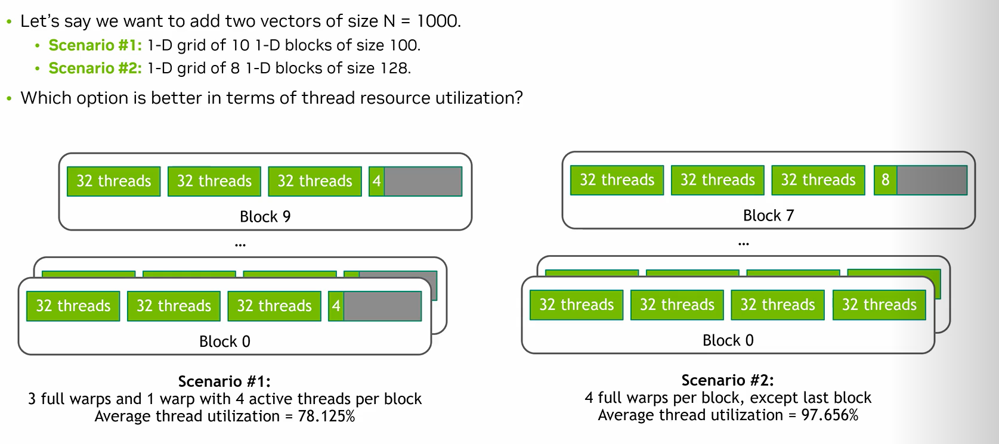
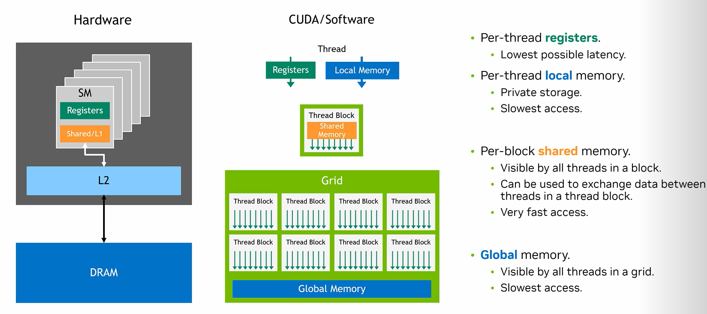

## 资料
* https://khairy2011.medium.com/tpu-vs-gpu-vs-cerebras-vs-graphcore-a-fair-comparison-between-ml-hardware-3f5a19d89e38
* https://flashinfer.ai/2024/02/02/cascade-inference
* https://developer.nvidia.com/blog/cuda-refresher-reviewing-the-origins-of-gpu-computing/
* CUDA优化：https://www.nvidia.com/en-us/on-demand/session/gtc24-s62191/

## 数据
* TPU vs GPU内存、带宽、算力对比图：

* 内存模型

* Thread Block vs SM:
    * 每个thread block是由一个SM来执行，并且不能跨越多个SM；
    * 一个SM上可以并发调度多个thread block；
    * 一个kernel是在一个GPU上执行，而一个GPU可以同时执行多个kernel；

* Shared memory: 一个block内threads共享的内存；
* 一个大的计算问题，被分解成多个并行的小问题，这些独立的小问题在各自的CUDA block中独立支行，CUDA runtime将决定如何/何时调试这些CUDA blocks到SM上，因此CUDA程序可以在任意数量的SM上扩展运行；
* 如下图所示，一个CUDA程序有8个block，在不同数量SM的GPU上，可以有不同的调度方案，如在4个SM的GPU上，每个SM将调度上2个block，而在8个SM的GPU上，每个SM将调度1个block；

### warps
* 在thread block运行阶段，block内的thread会被划分到`warps`中来执行SIMT，即如`warps`的字面意思，里面有多条并行线程（一般是32），这些线程在SM上并行执行同一个`instruction`；
* `warp`中的线程具有连续、递增的线程ID，第一个`warp`包含`threadId=0`的线程；
* 一个block包含的`warps`数量定义为：`ceil(threads per block / warp size, 1)

* thread block size vs warps:

### Memory
* per-thread registers (L0): 最高效的内存访问
* per-thread local memory: 位于DRAM中，私有化数据，速度最慢；
* per-block memory (L1): 
    * block中所有threads可见，用于block内threads的数据交互；
    * 速度低于register；

* Global memory:
    * 所有grid中的线程可见；
    * 效率最低；

