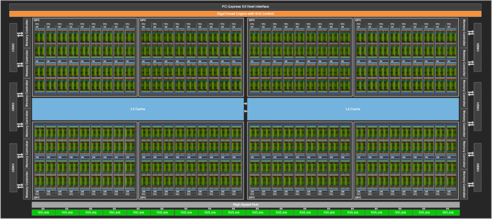
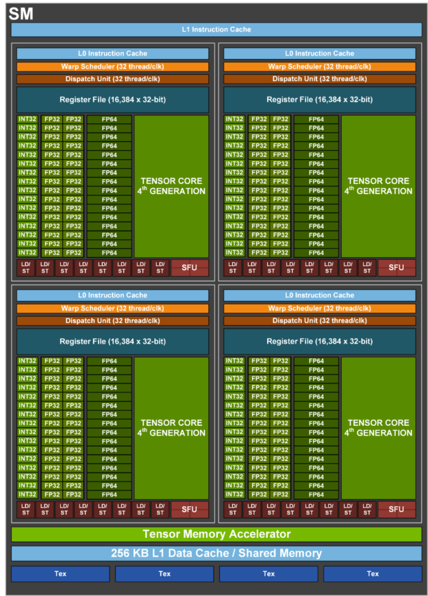
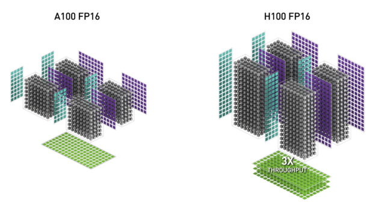
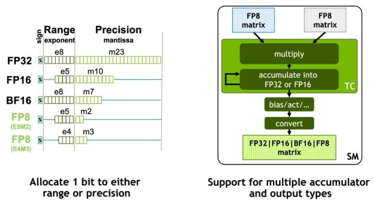
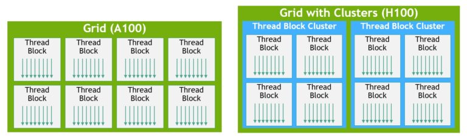
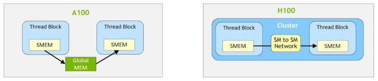
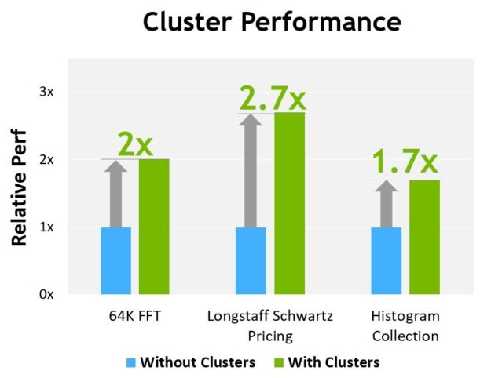

## Grace Hopper
### 资料
* https://developer.nvidia.com/zh-cn/blog/nvidia-grace-hopper-superchip-architecture-in-depth/
* https://developer.nvidia.com/blog/nvidia-hopper-architecture-in-depth/
* H100 Architecture Overview: https://resources.nvidia.com/en-us-tensor-core?ncid=no-ncid

## 关键特性
* 计算架构：sm90
* `H100 + InfiniBand`性能是A100的30x；
* `H100 + NVLink`性能是`H100 + InfiniBand`的3x；
* 与A100相比，H100的第四代Tensor Core有较大的提升：6x 芯片间速度，更快的SM，更多的SM，更高的clocks；同样的数据类型、数据量下，H100 SM计算速率是A100 SM的2x；
* **New thread block cluster**: 支持比单个SM上的单个thread block更大的粒度的编程局部性支持；扩展了CUDA编程模型：`thread`, `thread block`, `thread block cluster`, `grid`； 
* **Distributed shared memory**: 支持直接SM-to-SM通信：跨域多个SM SMEM的数据交互；
* **New asynchronous execution** + **TMA(Tensor Memory Accelerator)**: TMA允许直接在HBM与SMEM之间传输大块的数据，也支持在一个`thread block cluster`中异步`thread block`拷贝的数据；
* **New asynchronous barrier**: 新的异步事务屏障；
* **HBM3**: 相比于A100的HBM2e，带宽提升2x，达到3TB/s；
* 60MB L2 cache (GH100), 50MB L2 (H100 SXM5主板), 50MB L2 (H100 PCIe Gen5)；
* 第二代MIG技术；
* 第四代NVLink技术：all-reduce操作带宽提升3x，900GB/s，是PCIe Gen5的7x；
* PCIe Gen5: 提供128GB/s总带宽，单个方向64GB/s；

### 异步
* 真正的异步GPU：支持应用构建出E2E的异步pipeline：允许将数据into and off the chip，完全重叠和隐藏计算与数据移动；
* 只要少量CUDA thread通过使用TMA来完全利用起全部的内存带宽，同时其它剩余的CUDA thread聚焦于纯粹的计算，如Tensor Core计算的前后数据处理；

### 数据
* 8个GPC (GPU processing clusters)
* GH100: 144个SM
* H100+SXM5: 132个SM, 80GB HBM3
* H100+PCIe5: 114个SM, 80GB HBM2e
* 128个FP32 CUDA Cores per SM
* 4个第四代Tensor Core per SM

### H100 SM 架构
* 下图即为一个H100 SM(streaming multiprocessor)的架构图：

### H100 SM
* chip-to-chip对比A100有6x提升 （3x chip-to-chip processing rate + 2x clock-for-clock）；
* 同FP16来对比，Tensor Core相比A100提升2x，如采用FP8则是4倍；
* Sparsity相比标准Tensor Core运算，性能又能提升2x；
* `asynchronous execution` + `TMA` + `asynchronous transaction barrier`
* `thread block cluster`
* `SM-to-SM` SMEM直接通信；

### 4th Gen Tensor Core (TC)
* Tensor Core: 硬件MMA（matrix multiply and accumulate）计算核心；
* 首次在V100中引入；
* 与A100相比，4th Gen Tensor Core为每个SM提升了2x的运算能力；
* 支持数据类型：INT8, FP16, BF16, TF32, INT8 MMA；

### FP8
* H100支持了FP8 Tensor Core：支持FP32, FP16 accumulators，支持两种类型的FP8格式，如下图所示：

* FP8 vs FP16: 吞吐翻倍，内存减半

### Thread block clusters
* CUDA编程模型长期因GPU架构的特点，复用grid来实现程序中多个`thread block`的局部性，`thread block`包含多个thread，这些thread在单个SM上并行运行，其中这些线程通常是什么fast barriers来实现synchronize，以达到通过SM SMEM来交换数据的目标；
* 而随着GPU SM数量超过100个，计算程序的变得越来越复杂，`thread block`作为编程模型中的唯一局部性单元已不足最大限度的利用GPU；
* 因此H100引入了一种全新的`thread block cluster`架构，该构架以大于单个SM上的单个`thread block`的粒度来提供局部性控制，该架构扩展了CUDA编程模型，在GPU的物理编程结构上增加了一个级别：`thread`, `thread block`, `thread block cluster`, `grid`；
* cluster是一组`thread block`，这些block可以保证同时调度到一组SM上，其目标是用于实现多个SM之间的高效协作，实现GPC内的SM并发；
* GPC是硬件层次的一组SM，他们在物理上靠近，clusters具有hardware acceelerator barriers和新的内存访问协作能力，GPC提供了专用了SM-to-SM网络，用于cluster内的thread实现数据传输/共享；

### Distribute shared memory(DSMEM)
* DSMEM: 在clusters中，threads可以直接访问其它SM的SMEM数据；
* DSMEM中的虚拟地址空间是在逻辑上跨域cluster上的多个`thread block`的；
* DSMEM的存在，cluster上的SM之间的数据交互就不再需要先写入Global Mem再读写SMEM的过程，而是利用专用的SM-to-SM网络完成对远程数据的快速、低延迟访问（与访问Global Mem相比，速度提升了7x）；

