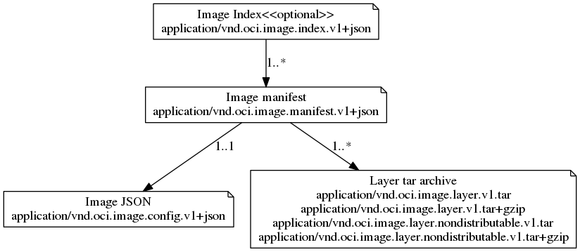
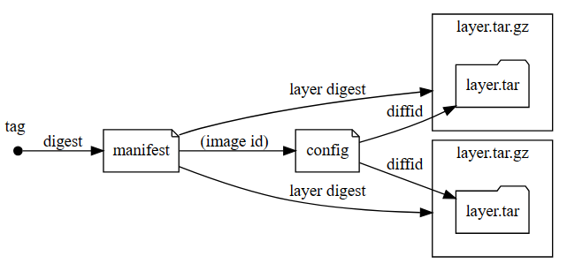

## OCI镜像规范
### 资料
* https://arkingc.github.io/2017/05/05/2017-05-05-docker-filesystem-overlay/
* https://docs.docker.com/storage/storagedriver/overlayfs-driver/
* https://github.com/containers/skopeo/blob/main/install.md
* https://www.rectcircle.cn/posts/oci-image-spec/
* https://github.com/opencontainers/distribution-spec

### OCI镜像格式标准
> https://www.rectcircle.cn/posts/oci-image-spec/
> https://github.com/opencontainers/image-spec

* OCI定义了镜像的格式规范：即镜像的文件和目录结构，相关的配置协议格式等；
* 如下图为一demo示图：

* 可以通过`skopeo`工具将docker镜像导出为OCI标准目录；
```bash
# 如该命令为利用skopeo镜像完成将nginx镜像导出OCI标准目录
docker run --rm -v ./:/data  quay.io/skopeo/stable:latest copy docker://nginx:latest oci:/data/nginx
```
如下所示：
```bash
hbb@hbb:~/tmp/oci$ tree nginx/
nginx/
├── blobs
│   └── sha256
│       ├── 161ef4b1bf7effb350a2a9625cb2b59f69d54ec6059a8a155a1438d0439c593c
│       ├── 2d455521f76cee8b8b2e21457075cc500c60373d70acb217f12838818fc3da90
│       ├── 2f44b7a888fa005d07c031d3cfad2a1c0344207def2ab9dbb97712425ff812c1
│       ├── 35497dd96569b9139cd388fd7107df32ccdc1449b205536bce0968b2dec3e7dc
│       ├── 36664b6ce66b304efa7ba48eb960133a085c2ec800a9f8887df94a82679334c1
│       ├── 8056d2bcf3b682573ee5b0c176c1209df285d5be0df98ec6ae08bf7421179b74
│       ├── 8b7dd3ed1dc34cc1caba38bbbf22bceda5bd2e7c4e1b3c11ca64cda2ed186a2c
│       ├── a8758716bb6aa4d90071160d27028fe4eaee7ce8166221a97d30440c8eac2be6
│       └── dc9c4fdb83d69ef5986ec344c6b75606b3a417c7434268cb6995962be5312f14
├── index.json
└── oci-layout
```
<!-- more -->
可以看到OCI镜像由以下内容组成：
#### 1. oci-layout
* 该文件为镜像布局版本号

#### 2. blobs
* 存储镜像的所有文件，包括manifest, config，也包括layers文件，以sha256为文件/目录名；

#### 3. index.json
* 其内容如下，该文件即为镜像的索引文件，可以理解为其入口：
```json
{
    "schemaVersion":2,
    "manifests":[
        {
            "mediaType":"application/vnd.oci.image.manifest.v1+json",     
            "digest":"sha256:161ef4b1bf7effb350a2a9625cb2b59f69d54ec6059a8a155a1438d0439c593c",
            "size":1989
        }
    ]
}
```
* 该文件中指定了其manifest文件列表，其中的`mediaType`为OCI的文件类型，其定义了几种文件类型，以代表如json, tar.gz等文件格式；
* menifests中的`digest`为该manifest文件的sha256值，可以通过该值在`blobs/sha256`目录中找到该json文件的内容；

##### manifest文件

* manifest文件为JSON格式文件，包含：镜像配置文件的引用和文件系统层文件（镜像layers）的引用；
```json
{
  "schemaVersion": 2,
  "mediaType": "application/vnd.oci.image.manifest.v1+json",
  "config": {
    "mediaType": "application/vnd.oci.image.config.v1+json",
    "digest": "sha256:a8758716bb6aa4d90071160d27028fe4eaee7ce8166221a97d30440c8eac2be6",
    "size": 7016
  },
  "layers": [
    {
      "mediaType": "application/vnd.oci.image.layer.v1.tar+gzip",
      "digest": "sha256:2f44b7a888fa005d07c031d3cfad2a1c0344207def2ab9dbb97712425ff812c1",
      "size": 29125921
    },
    {
      "mediaType": "application/vnd.oci.image.layer.v1.tar+gzip",
      "digest": "sha256:8b7dd3ed1dc34cc1caba38bbbf22bceda5bd2e7c4e1b3c11ca64cda2ed186a2c",
      "size": 41373256
    },
    {
      "mediaType": "application/vnd.oci.image.layer.v1.tar+gzip",
      "digest": "sha256:35497dd96569b9139cd388fd7107df32ccdc1449b205536bce0968b2dec3e7dc",
      "size": 628
    },
    {
      "mediaType": "application/vnd.oci.image.layer.v1.tar+gzip",
      "digest": "sha256:36664b6ce66b304efa7ba48eb960133a085c2ec800a9f8887df94a82679334c1",
      "size": 955
    },
    {
      "mediaType": "application/vnd.oci.image.layer.v1.tar+gzip",
      "digest": "sha256:2d455521f76cee8b8b2e21457075cc500c60373d70acb217f12838818fc3da90",
      "size": 366
    },
    {
      "mediaType": "application/vnd.oci.image.layer.v1.tar+gzip",
      "digest": "sha256:dc9c4fdb83d69ef5986ec344c6b75606b3a417c7434268cb6995962be5312f14",
      "size": 1207
    },
    {
      "mediaType": "application/vnd.oci.image.layer.v1.tar+gzip",
      "digest": "sha256:8056d2bcf3b682573ee5b0c176c1209df285d5be0df98ec6ae08bf7421179b74",
      "size": 1398
    }
  ],
  "annotations": {
    "org.opencontainers.image.revision": "4bf0763f4977fff7e9648add59e0540088f3ca9f",
    "org.opencontainers.image.source": "https://github.com/nginxinc/docker-nginx.git#4bf0763f4977fff7e9648add59e0540088f3ca9f:mainline/debian",
    "org.opencontainers.image.url": "https://hub.docker.com/_/nginx",
    "org.opencontainers.image.version": "1.25.3"
  }
}
```

##### config文件
* 在manifest文件中有一段config内容，引用了该config文件的sha256值，通过该值可以读取到该文件的内容，如下述mainfest文件的config为：
```json
"config": {
    "mediaType": "application/vnd.oci.image.config.v1+json",
    "digest": "sha256:a8758716bb6aa4d90071160d27028fe4eaee7ce8166221a97d30440c8eac2be6",
    "size": 7016
  }
```
* 读取该config json文件的内容如下示例所示，可以看到该文件给出了整个镜像的所有信息，包括其rootfs和config，这些配置是**容器运行时标准**`runC`运行的基本必要前提配置；
```json
{
	"architecture": "amd64",
	"config": {
		"ExposedPorts": {
			"80/tcp": {}
		},
		"Env": [
            "PATH=/usr/local/sbin:/usr/local/bin:/usr/sbin:/usr/bin:/sbin:/bin", 
            "NGINX_VERSION=1.25.3", 
            "NJS_VERSION=0.8.2", 
            "PKG_RELEASE=1~bookworm"],
		"Entrypoint": ["/docker-entrypoint.sh"],
		"Cmd": ["nginx", "-g", "daemon off;"],
		"Labels": {
			"maintainer": "NGINX Docker Maintainers \u003cdocker-maint@nginx.com\u003e"
		},
		"StopSignal": "SIGQUIT",
		"ArgsEscaped": true,
		"OnBuild": null
	},
    "os":"linux",
    "rootfs":{
        "type":"layers",
        "diff_ids":[
            "sha256:571ade696b261f0ff46e3cdac4635afc009c4ed3429950cb95cd7e5f70ba0a07",
            "sha256:b6c2a8d6f0ac89ef77e161532f3d9d0dc5dfe0a5f20042e0afc0ad14288405eb",
            "sha256:b61d4b2cd2daf06047984c5876a35338c2beb5ae3f6bef479d25f05772a6a482",
            "sha256:eddcd06e5ef9b91677526f6c55fa01a7d6963c435d5cf2bfb488d91aaa72d4a8",
            "sha256:b4ad478450363f0a8020bb5552641fe6077e78fca48da4d77a979724a3ad2a72",
            "sha256:fbcc9bc44d3e165e7e4f56fb189a05ea5c562a733985ec00d5e3fad309eb63cc",
            "sha256:009507b8560964795eab5126f6363cb2b7403596adf370c9e95d4648c43e771f"
        ]
    },
	"created": "2023-10-24T22:44:45Z",
	"history": [
        {
			"created": "2023-10-24T22:44:45Z",
			"created_by": "/bin/sh -c #(nop) ADD file:9deb26e1dbc258df47629e6f8fbcea4e4b54e7673537cc925db16af858d9cc8d in / "
		}, 
        {
			"created": "2023-10-24T22:44:45Z",
			"created_by": "/bin/sh -c #(nop)  CMD [\"bash\"]",
			"empty_layer": true
		},
        // ... 删掉了后续很多记录
    ]
}
```
* 综合上述理解，再看下图的镜像组成结构即能很好理解：



### OCI镜像分发标准
> https://github.com/opencontainers/distribution-spec

* 该标准定义了一套HTTP API 协议，以促进和标准化镜像内容的分发；
* 该标准定义镜像仓库应该实现的接口协议以及镜像分发过程的交互逻辑，如Pull, Push, Content Discovery, Content Management等；
* 所有的镜像仓库都必须最小实例Pull的所有API协议；

* 镜像在镜像仓库中的组成：


#### Pull
* pull镜像分两块：manifest的拉取和blobs文件（可能多个）的拉取；
* 一般是先pull manifest，再pull blobs；
* pull manifest API:
```HTTP
GET /v2/<name>/manifests/<reference>
```
* pull blobs API:
```
GET /v2/<name>/blobs/<digest>
```
* 检查内容存在：
```
HEAD /v2/<name>/manifests/<reference>
or 
HEAD /v2/<name>/blobs/<digest>
```

#### Push
* 上传的顺序是blobs先上传，manifest后上传；
> It follows that during an upload, we need to upload layers before the config file, and we need to upload the config file before the manifest.
* 可在下面文档中查看上传的过程：
> https://github.com/google/go-containerregistry/tree/d7f8d06c87ed209507dd5f2d723267fe35b38a9f/pkg/v1/remote#anatomy-of-an-image-upload


### overlay2
> https://arkingc.github.io/2017/05/05/2017-05-05-docker-filesystem-overlay/#overlay2
> https://arkingc.github.io/2018/01/15/2018-01-15-docker-storage-overlay2/#%E6%8C%82%E8%BD%BD%E6%96%87%E4%BB%B6%E7%B3%BB%E7%BB%9F

* docker镜像的层包含容器层和镜像层，所谓容器层就是在容器运行起来后的层，如下图所示；

* overlay驱动实现了对多层进行联合挂载的机制来为容器提供可见的文件系统；


* 当前docker默认使用的存储驱动是`overlay2`，该驱动天然支持多层（最多128层）；
* 每层的目录由多个文件夹组成：`diff`, `lower`, `work`, `merged`, `link`，其中:
  * `link`是文件，保存了当前层的软连接信息，软连接是用于避免mount时因128层导致数据过大超出page限制；
  * `lower`是文件，保存了父层的信息；
  * `diff`是当前层相对于父层的不同文件/目录；
  * `merged`仅在容器层有，是在容器运行时，由overlay2驱动将所有diff进行合并后挂载起来的，提供给容器看到的文件夹，所以只有最上层的目录才有内容；
  * `work`目录用于copy-up操作；
* 镜像最底层不包含`lower`文件夹；
* 容器挂载阶段，在docker Driver的源码实现中，本质就是调用了overlay2驱动的mount命令：
```go
func (d *Driver) Get(id string, mountLabel string) (s string, err error) {
  // ...
  //挂载命令的参数字符串
	opts := fmt.Sprintf("lowerdir=%s,upperdir=%s,workdir=%s", strings.Join(absLowers, ":"), path.Join(dir, "diff"), path.Join(dir, "work"))
	//挂载命令的数据
	mountData := label.FormatMountLabel(opts, mountLabel)
	//挂载函数
	mount := syscall.Mount
	//挂载目标目录
	mountTarget := mergedDir
  // ...
  if err := mount("overlay", mountTarget, "overlay", 0, mountData); err != nil {
		return "", fmt.Errorf("error creating overlay mount to %s: %v", mergedDir, err)
	}
  // ...
}
```
* 删除/停止容器时，overlay2驱动仅仅做的是卸载`merged`目录的挂载：
```go
func (d *Driver) Put(id string) error {
	d.locker.Lock(id)
	defer d.locker.Unlock(id)
	//获取该层路径
	dir := d.dir(id)
	//读取lower文件，获取lower层信息
	_, err := ioutil.ReadFile(path.Join(dir, lowerFile))
	if err != nil {
		// If no lower, no mount happened and just return directly
		// ....
	}

	//获取挂载点路径，即merged目录的路径
	mountpoint := path.Join(dir, "merged")
	//挂载时增加了引用计数，卸载时减少
	if count := d.ctr.Decrement(mountpoint); count > 0 {
		return nil
	}
	//卸载
	if err := syscall.Unmount(mountpoint, 0); err != nil {
		logrus.Debugf("Failed to unmount %s overlay: %s - %v", id, mountpoint, err)
	}
	return nil
}
```