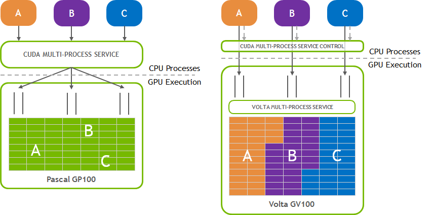

## 资料
* Time-Slicing Sharing: https://developer.nvidia.com/blog/improving-gpu-utilization-in-kubernetes
* MPS：https://docs.nvidia.com/deploy/mps/index.html

## MPS
* MPS(Multi-Process Service)是CUDA应用编程API的一个可替换的、二进制兼容的实现，其运行时架构是设计用于透明的处理多CUDA进程的协作/交互，如MPI任务；
* 该技术利用了NVIDIA GPU的Hyper-Q能力，Hyper-Q允许CUDA kernel在同一个GPU上并行处理；

### Volta MPS
* Volta MPS相对于之前的构架，在MPS上有较大变化，主要表现为：
1. Volta MPS client可以直接向GPU提交任务，而无需再经过MPS Server；
2. 每个Volta MPS client都拥有其自己的GPU地址空间，而不是与其它MPS client共享一个地址空间；
3. Volta MPS支持了有限的计算资源配置，以提供QoS；

### MPS组件
1. `Controll Daemon Process`: 负责启动、停止server、协调客户端与服务端的连接；
2. `Client Runtime`: MPS client runtime直接编译进了CUDA驱动库中，因此可以透明应用到CUDA程序中；
3. `Server Process`: Server提供多个clients共享连接到GPU的通道，提供给client并行能力；

### MPS带来的优势
1. GPU利用率提升：单个进程往往无法利用满GPU的算力与内存带宽，MPS能够实现多个进程的kernel, memcpy的overlap，因此能够提升GPU的利用率；
2. GPU上下文资源占用的减少：在不使用MPS的场景，每个GPU进程都需要分配独立的存储与调度资源，而在MPS的场景下，多个client共享同一个GPU存储与调度资源，同时volta架构中还进一步提供了资源的隔离，因此能有效减少上下文资源的占用；
3. 减少GPU Context切换：在无MPS场景下，多个进程共用一个GPU时，他们的调度资源需要在GPU上执行swapped on and off，而MPS模式下共享一个调度资源，所以不再需要调度上下文的切换；

### 适用场景
* MPS适用于进程无法很好让GPU饱和式运行的场景，如small number of blocks-per-grid；
* 另如果进程存在因small number of threads-per-grid导致的GPU利用率低，也可以通过MPS来提供GPU的利用率，这种应用类型下，可以提供blocks的线程数量，减少block数量，以提升单个block的GPU利用率；
* 这些应用通常是位于强扩展型任务中：即任务规模不变，通过扩展计算能力（如GPU数、节点数），导致单个进程的工作量减少；

### 考虑点
#### 系统层面
##### 限制
* Linux系统下支持；
* GPU计算CC（Compute Capability）>=3.5；
* CUDA UVA（Unified Virtual Addressing）必须开启；
* MPS client能分配的page-locked主机内存的大小由/dev/shm tempfs文件系统限制；
* Exclusive-mode限制是由MPS server提供的，不是由MPS client提供；
* 一个系统上只能有一个用户有一个活跃的MPS server；
* `MPS Control Daemon`进程将对来自不同用户的请求在MPS server中排队，导致表现为不同用户对GPU的请求是独占的，无论GPU的exlusive-mode是何配置；
* 所有的MPS client的行为在监控工具层面都将归属到MPS server上，因此我们无法观察到不同client对GPU的监控数据（nvidia-smi, NVML API等）；

##### GPU Compute Mode
* `nvidia-smi`支持设置三种计算模式：
1. `PROHIBITED` 该GPU禁止用于计算；
2. `EXCLUSIVE_PROCESS` GPU只能被一个进程同时访问，进程内的线程可以并行访问GPU；
3. `DEFAULT` GPU可以被多个进程同时访问，不同进程的线程可以并行访问GPU；

* MPS用的好，`EXCLUSIVE_PROCESS`模式的效果将与`DEFAULT`模式效果表现差不多；
* 使用MPS是推荐开启`EXCLUSIVE_PROCESS`模式，以确保GPU只有一个进程在使用；

#### 应用层面
* 不支持Dynamic parallelism特性；
* 终止一个MPS client时，如果没有synchronize所有正在运行的GPU work，如通过Ctrl+C或程序崩溃，则会导致MPS server或其它MPS client处于undefined状态，这可能会导致hang或异常失败状态；

#### 内存保户与Error封装
* Volta架构后，各client都自己的地址空间；
* 提供有限的错误封装：同一张卡上运行的多个client，如其中一个client出现了失败，则会影响到卡上的其它client，这些client都会接收到失败，需要处理并exit；
> error处理可参考：https://docs.nvidia.com/deploy/mps/index.html#error-containment

#### 多GPU
* MPS支持多GPU使用场景；

### 性能
1. client-server连接数限制：48 client cuda-context per-device；
2. 支持一定的SM级别资源限制能力，具体可参考：https://docs.nvidia.com/deploy/mps/index.html#volta-mps-execution-resource-provisioning；
3. 显存上也支持一定程度的配置能力；

### 架构
* stream代表了一个软件层的抽象，其封装了一系列有序的命令，如kernels, memcpy等，处于不同stream上的work是可以并行执行的；
* stream会被映射到一个或多个GPU driver的work queues，work queue是GPU硬件级的一种资源，其上是有序的等GPU执行的命令；
* 带Hyper-Q能力的GPU，会为每个CUDA context分配一个具体的scheduler用于调度该context上关联的work queues的任务，同一个context上关联的不同work queue的计算任务是可以被GPU并行调度执行的；
* GPU同时拥有time-sliced调度能力来调度不同CUDA context上的work queues任务：不同context上的work queue能被并行调度，
